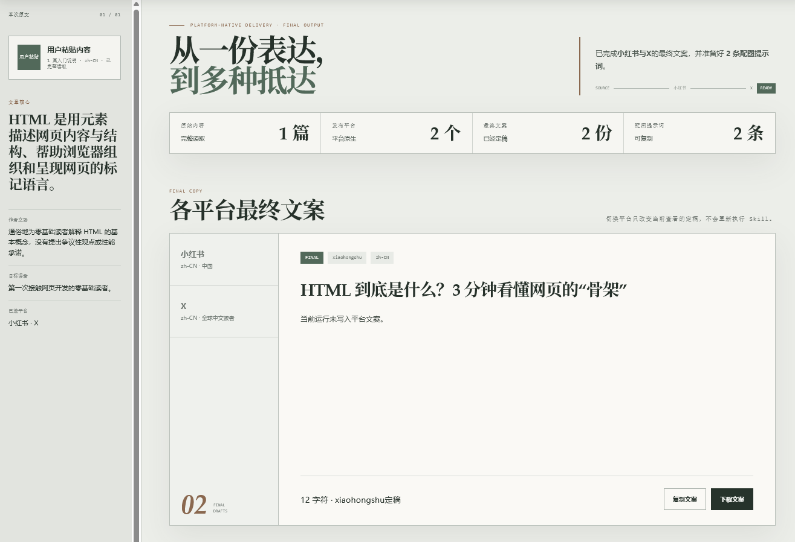
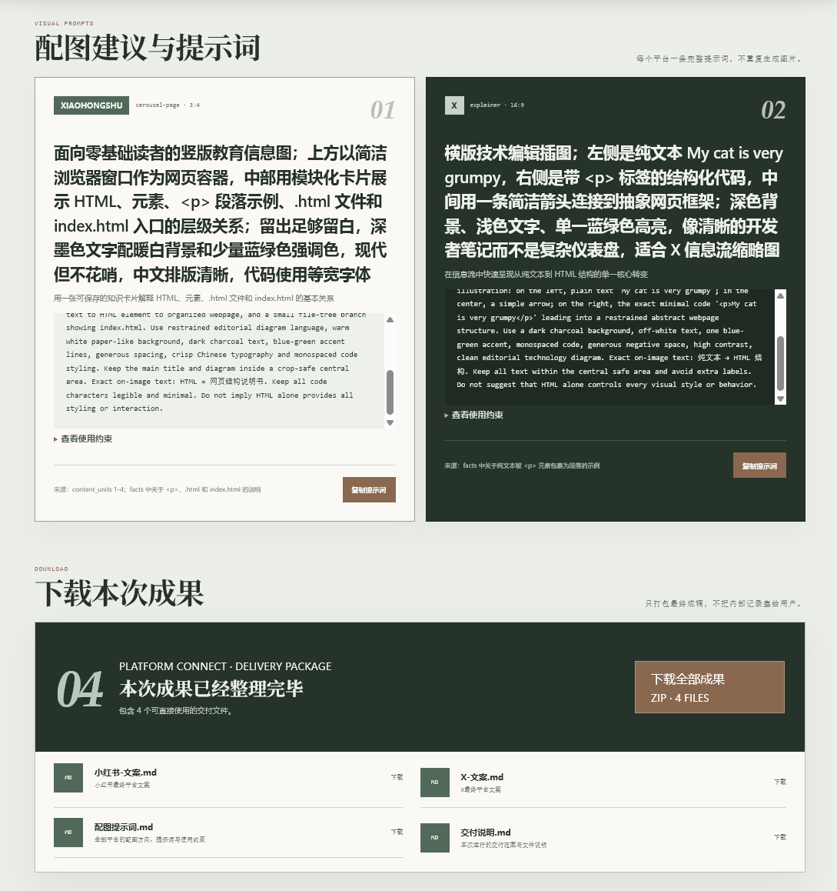

# Platform Connect

<p align="center">
  <a href="https://skills.sh/halexzd686-cloud/Platform-Connect">
    
  </a>
</p>

<p align="center">
  <strong>从一份表达，到多种抵达。</strong>
</p>

<p align="center">
  把正文、文档或文章链接交给 Agent，获得事实一致的平台原生文案、<br>
  可直接使用的配图提示词，以及一份可以打开、复制和下载的离线成果看板。
</p>

<p align="center">
  <a href="#快速开始">快速开始</a> ·
  <a href="#交付结果">交付结果</a> ·
  <a href="#工作原理">工作原理</a> ·
  <a href="#开发与测试">开发与测试</a>
</p>



## 这不是聊天记录，而是一次完整交付

Platform Connect 先完整理解原文，再根据不同平台的内容习惯重新组织表达。最终成果不会散落在对话里，
而是被整理成可追溯、可复制、可下载的静态交付页。

## 为什么选择 Platform Connect

Platform Connect 不是 React/FastAPI AI 应用，也不是把同一段文案换标题后批量分发。它是一套
可安装的 Agent Skill：Agent 负责理解原文、适配平台、协作决策与编排视觉提示词；仓库脚本负责
可重复的目录创建、Manifest 校验、交付索引和静态页面渲染。

| 能力 | 说明 |
| --- | --- |
| 直接读取常见来源 | 支持粘贴正文、TXT、Markdown、Word、PDF、HTML 文件和文章链接 |
| 事实基线 | 先建立共享内容简报，平台文案和生图提示词都从同一事实来源派生 |
| 平台推荐 | 未指定目标时推荐 2–3 个适合的平台，并兼顾国内外发布场景 |
| 原生文案适配 | 针对平台调整开场、节奏、结构与 CTA，不改变原文事实 |
| 提示词式视觉交付 | 按文章、平台和行业推荐可复制的提示词，不调用生图工具 |
| 结果型离线看板 | 最终文案、提示词与真实下载入口集中展示，可通过 `file://` 打开 |

## 交付结果

### 同一事实，不同表达

每个平台获得独立的内容结构，而不是同一份文案的机械复制。小红书可以强调共鸣与收藏价值，
LinkedIn 可以保留专业判断与讨论空间，其他平台则遵循各自的内容节奏和交互习惯。

### 图文资产集中交付

最终看板只保留三类主要内容：已经确认的平台文案、可复制的生图提示词和真实可下载成果。
来源简报、推荐依据和审批记录仍然保留，但默认折叠，不干扰用户查看最终成果。Skill 不生成
或预览图片。



### 一次运行，一个可追溯目录

```text
outputs/<article-slug>/<run-id>/
├── source-brief.md
├── manifest.json
├── index.md
├── downloads/
│   ├── Platform-Connect-成果包.zip
│   ├── <平台>-文案.md
│   ├── 配图提示词.md
│   └── 交付说明.md
├── showcase/
│   ├── index.html
│   ├── app.js
│   └── styles.css
└── <platform>/
    └── copy.md
```

每次修改创建新的 `run_id`；`parent_run_id` 指向上一次运行，避免覆盖已经确认的交付结果。

## 快速开始

### 1. 安装当前版本 v1.4.1

按照 [skills.sh](https://skills.sh/halexzd686-cloud/Platform-Connect) 的标准命令安装最新版本：

```bash
npx skills add https://github.com/halexzd686-cloud/Platform-Connect --skill platform-connect
```

安装程序会引导选择 Agent 和安装范围。项目级安装是默认选择；只有明确需要在多个项目间复用时，
才选择全局安装；需要直接指定用户级安装时，可在命令末尾增加 `--global`。

### 2. 交给 Agent

在 Codex、Claude Code 或其他兼容 Agent 中调用 `$platform-connect`，直接发送文章正文、文件或链接：

> 使用 $platform-connect 处理这篇文章。如果我没有指定平台，请推荐 2–3 个国内外平台和配图方向，再让我一次完成选择。

不需要先编写复杂提示词。目标平台未指定时，Agent 只返回决策所需的推荐，不会提前为全部候选
平台生成完整文案。

### 3. 一次确认关键选择

默认 `compact` 流程把平台、是否需要生图提示词和完成方式合并确认；随后再用一次联合审阅处理
文案和提示词。用户也可以明确使用 `autopilot`：

> 使用 $platform-connect 的 full + autopilot。发布到小红书和 LinkedIn，需要生图提示词，无需中途确认，直接完成最终交付。

`full` 只交付提示词，不调用图片生成或编辑工具。

### 4. 打开交付看板

运行完成后，直接打开：

```text
outputs/<article-slug>/<run-id>/showcase/index.html
```

看板是 `copy` 和 `full` 任务的必备最终交付，不需要用户额外提出“保存文件”或“生成 HTML”。
它不承担与 Agent 对话或替代 Agent 决策的职责；页面中的平台切换只用于查看不同定稿，复制和
下载按钮作用于已经交付的文件，不会回写 Skill 决策。

## 工作原理


| 阶段 | 脚本 / 产物 | 责任 |
| --- | --- | --- |
| 运行初始化 | `prepare_workspace.py` | 创建独立运行目录和初始 Manifest |
| 来源简报 | Agent + `source-brief.md` | 固定核心观点、事实、受众与不可漂移内容 |
| 平台适配 | Agent + `<platform>/copy.md` | 生成平台原生文案并保留事实一致性 |
| 视觉交付 | Agent + `visual_prompts` | 生成平台化主提示词、负面约束、比例和事实不变量 |
| 最终交付 | `finalize_delivery.py` | 强制校验并生成离线看板、独立成果文件、索引和 ZIP 下载包 |
| 页面渲染 | `render_showcase.py` | 由最终交付命令调用，生成离线看板与下载文件 |
| 完整性校验 | `validate_manifest.py`、`validate_showcase.py` | 检查状态、数据、下载包和离线约束 |
| 交付索引 | `build_delivery_index.py` | 汇总运行结果与文件入口 |

## 审阅策略

| 策略 | 适用场景 | 交互方式 |
| --- | --- | --- |
| `compact` | 默认使用 | 合并关键选择，减少往返确认 |
| `strict` | 高风险内容或用户要求逐步控制 | 分阶段确认文案与视觉提示词 |
| `autopilot` | 用户明确要求直接完成 | 按预授权执行并直接交付文案与提示词 |

输出范围与审阅策略相互独立：

- `plan`：只生成内容简报、适配策略和视觉计划。
- `copy`：生成内容简报与平台文案，不提供视觉提示词。
- `full`：完成文案、生产级生图提示词、Manifest、离线看板和可下载成果包。

高频用户可以在工作目录创建 `platform-connect.profile.json`，保存默认平台、语言、市场、视觉提示词偏好
和审阅策略；当前请求始终优先于配置。

## 设计原则

- **原文是事实来源**：不因平台适配改写事实或引入未经支持的结论。
- **先理解，后分发**：所有平台内容都从共享内容简报派生。
- **推荐而不代替决定**：未指定平台时只推荐两个、最多三个，并解释适配理由。
- **减少对话往返**：默认合并可安全合并的确认，高风险歧义才拆分处理。
- **不调用图片工具**：即使用户提出“配图”或“生图”，也只交付可直接使用的提示词。
- **控制提示词数量**：默认每个平台一条、总数不超过三条，用户明确要求时再扩展。
- **结果优先展示**：最终看板先呈现文案、提示词和下载成果，过程记录默认折叠。
- **唯一源码**：仓库只维护 `skills/platform-connect`，不直接修补安装副本或生成后的页面。
- **离线交付**：展示页不发起远程请求，也不要求用户安装前端运行环境。

## 项目结构

```text
Platform-Connect/
├── skills/
│   └── platform-connect/
│       ├── SKILL.md
│       ├── agents/
│       ├── assets/
│       ├── references/
│       └── scripts/
├── designs/
├── tests/
└── skills-lock.json
```

- `skills/platform-connect/` 是 GitHub 仓库中的唯一 Skill 源码。
- `.agents/skills/platform-connect/` 是项目级安装副本，可删除、可重装，不提交 Git。
- `skills-lock.json` 记录安装来源和内容哈希，用于依赖核对与恢复。

不要直接修改安装副本。发现问题时修改唯一源码、运行测试并重新安装，也不要修补 `.claude/`
或生成后的看板。

## 开发与测试

运行完整回归测试：

```powershell
python -m unittest discover -s tests -p "test_*.py" -v
node --test tests/test_showcase_runtime.mjs
```

运行官方 Skill 校验：

```powershell
$validator = Join-Path $env:USERPROFILE ".codex\skills\.system\skill-creator\scripts\quick_validate.py"
python -X utf8 $validator `
  skills/platform-connect
```

## 运行要求

- Python 3.10+
- Node.js 20+（仅开发和前端回归测试需要）
- 支持 Agent Skills 的 Agent 运行环境

## 参与贡献

欢迎提交问题报告与改进建议。若修改交互流程、Manifest Schema、确定性脚本或离线看板模板，请
同时补充对应回归测试，并确保生成结果仍可通过 `file://` 直接运行。

## License

本项目采用 [MIT License](LICENSE)。第三方来源与署名要求见
`skills/platform-connect/references/third-party-notices.md`。
