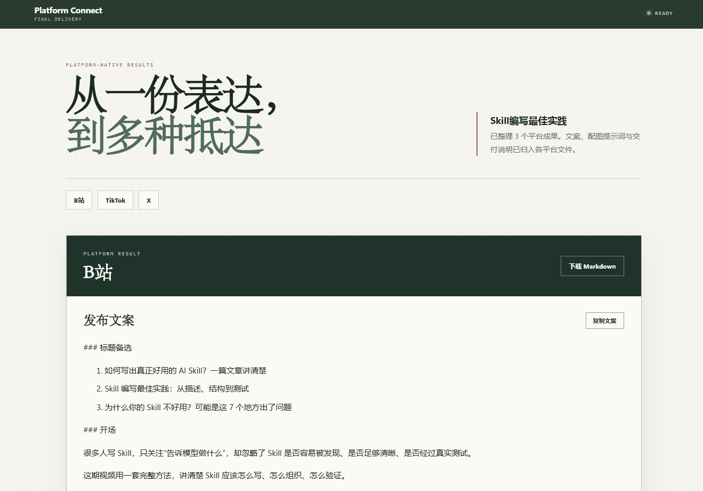
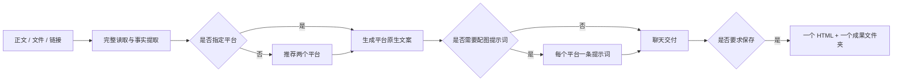

# Platform Connect

<p align="center">
  <a href="https://skills.sh/halexzd686-cloud/Platform-Connect">
    
  </a>
</p>

<p align="center">
  <strong>从一份表达，到多种抵达。</strong>
</p>

<p align="center">
  直接读取正文、文档或文章链接，生成事实一致的平台原生文案与可选配图提示词。<br>
  默认在聊天中完成；需要保存时，只生成一个 HTML 和一个平台成果文件夹。
</p>



## 它解决什么问题

Platform Connect 是一项可安装的 Agent Skill，不是独立的前后端 AI 应用。用户只需发送文章并说明目标平台；Agent 负责完整阅读来源、保留事实、调整平台表达并完成交付。

| 能力 | 行为 |
| --- | --- |
| 直接读取来源 | 支持粘贴正文、TXT、Markdown、Word、PDF、HTML 和文章链接 |
| 平台推荐 | 未指定目标时推荐两个合适平台，兼顾国内外使用场景 |
| 平台原生改写 | 分别调整开场、节奏、结构、语言与 CTA，不机械复制 |
| 可选配图提示词 | 用户需要配图时，每个平台提供一条可编辑提示词，不实际生成图片 |
| 事实与风险控制 | 不虚构事实；法律、医疗、金融、品牌等高风险歧义才暂停确认 |
| 极简文件交付 | 默认聊天交付；用户要求保存时生成一个 HTML 和一个成果文件夹 |

## 安装当前版本 v1.5.0

按照 [skills.sh](https://skills.sh/halexzd686-cloud/Platform-Connect) 的标准格式安装：

```bash
npx skills add https://github.com/halexzd686-cloud/Platform-Connect --skill platform-connect
```

## 使用

无需编写复杂提示词。调用 `$platform-connect` 后直接发送正文、文件或链接：

> 使用 $platform-connect 处理这篇文章，发布到小红书和 X。

未指定平台时：

> 使用 $platform-connect 处理附件中的文章。如果我没有指定平台，请推荐两个适合的国内外平台。

需要配图提示词时：

> 使用 $platform-connect 生成小红书和 LinkedIn 文案，并为每个平台提供一条配图提示词，不要实际生成图片。

需要文件交付时：

> 完成后请保存为一个 HTML 展示页和平台 Markdown 成果文件。

## 默认流程



默认不创建审批状态、Manifest、事实简报文件、版本树或执行记录。只有来源不完整或存在实质性高风险歧义时，Agent 才会集中询问一次。

## 可选文件交付

每个平台使用一个 Markdown 文件：

```markdown
# 小红书

## 发布文案

最终平台文案。

## 配图提示词

一条可编辑提示词；未请求时写“本次未请求配图提示词”。

## 交付说明

必要的事实、市场或使用提醒。
```

运行单一交付脚本：

```powershell
python skills/platform-connect/scripts/deliver.py `
  drafts/小红书.md drafts/X.md `
  --title "本次主题" `
  --output-root outputs
```

最终只生成：

```text
outputs/<run-id>/
├── showcase.html
└── <本次主题>/
    ├── 小红书.md
    └── X.md
```

`showcase.html` 内联全部 CSS 和 JavaScript，可离线打开；平台 Markdown 同时包含文案、配图提示词与交付说明。

## 项目结构

```text
Platform-Connect/
├── skills/platform-connect/
│   ├── SKILL.md
│   ├── agents/openai.yaml
│   ├── references/
│   │   ├── source-intake.md
│   │   ├── platform-adapters.md
│   │   ├── visual-handoff.md
│   │   └── output-schema.md
│   └── scripts/deliver.py
├── tests/
└── skills-lock.json
```

仓库只维护 `skills/platform-connect/` 这一份 Skill 源码。项目级安装副本位于 `.agents/skills/` 等目录，不应提交或直接修改。

## 开发与测试

运行回归测试：

```powershell
python -m unittest discover -s tests -p "test_*.py" -v
```

运行官方 Skill 验证：

```powershell
$validator = Join-Path $env:USERPROFILE ".codex\skills\.system\skill-creator\scripts\quick_validate.py"
python -X utf8 $validator skills/platform-connect
```

运行要求：Python 3.10+。HTML 展示页不需要 Node.js、React、FastAPI、CDN 或网络连接。

## License

本项目采用 [MIT License](LICENSE)。
